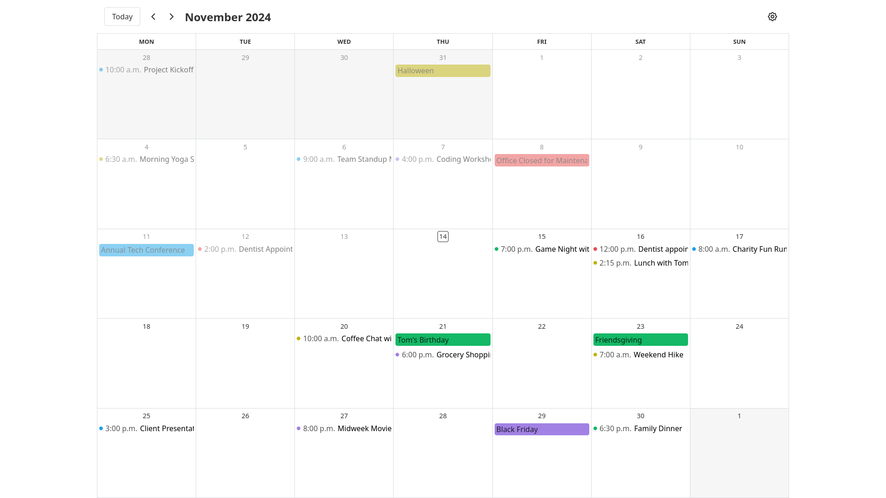
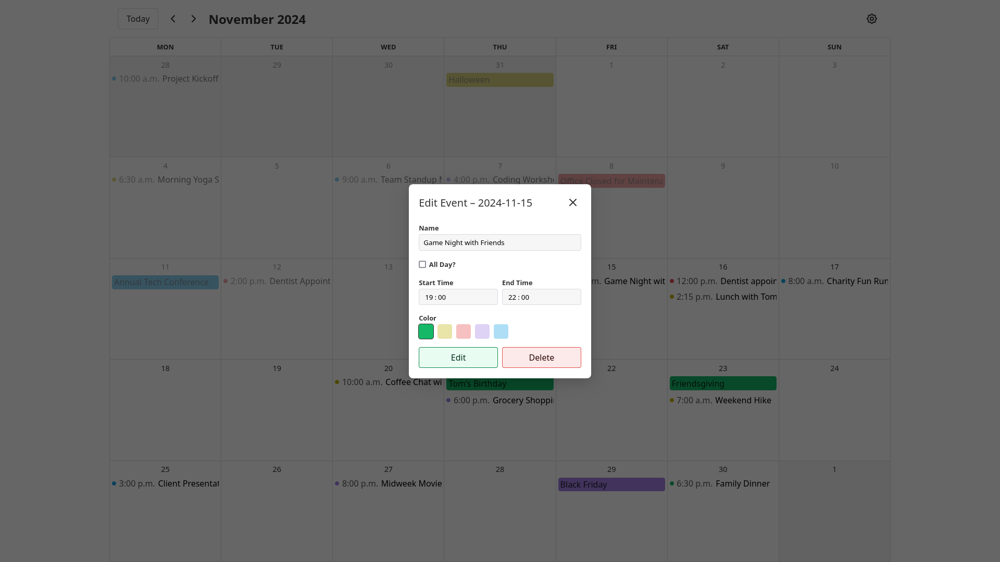
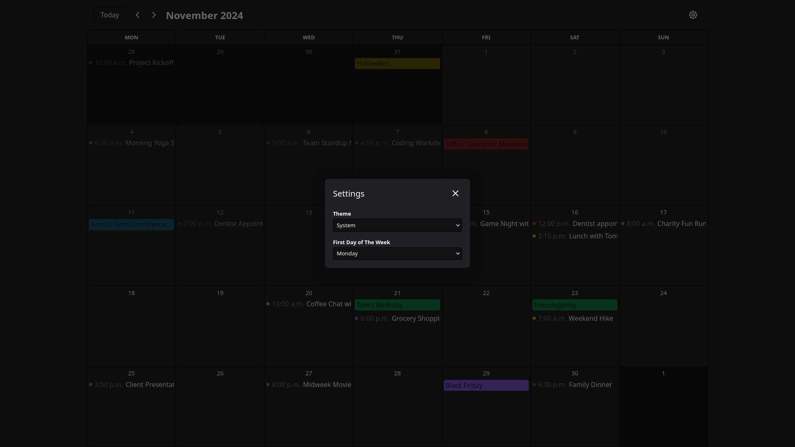
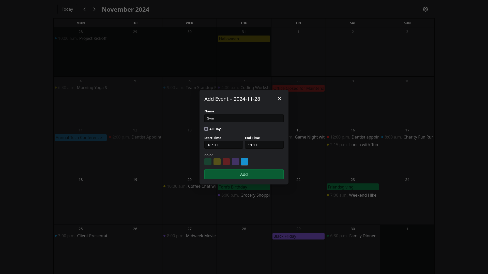

# Zenith Calendar

## About

Zenith Calendar is a React based calendar app inspired by Google Calendar. Build with React, Vite, SCSS, date-fns and Tabler.

## Live Preview

https://zenith-calendar.netlify.app/

## Features

- **Modern Calendar Experience**: Create, edit and delete events in a modern and convenient way. View saved events for any month.
- **Event Personalization**: Add standard events as well as all-day events and group them by colors.
- **Auto-save**: Keep the events in the local storage and easily access them.
- **Customization**: Change the first day of the week to Monday, Saturday or Sunday.
- **Dark Mode**: Switch between light and dark modes.
- **Modern UI**: Clean, professional design with consistent color schemes, fonts and style.

## Screenshots

## Run Locally

1. Clone the project to your local machine:

`git clone https://github.com/kaklewski/zenith-calendar.git`

2. Navigate to the project directory:

`cd zenith-calendar`

3. Install the dependencies:

`npm install`

4. Start the development server:

`npm run dev`

## Build with Vite

1. Build the dist:

`npm run build`

2. Preview the build:

`npm run preview`
